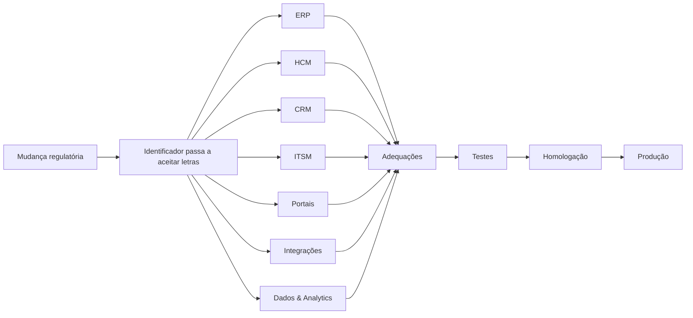
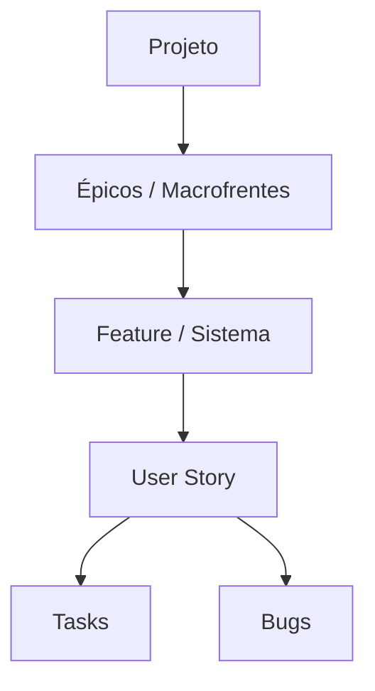
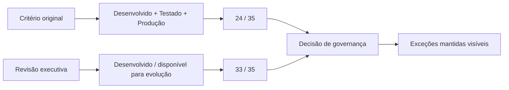
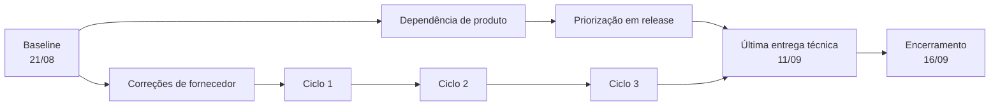
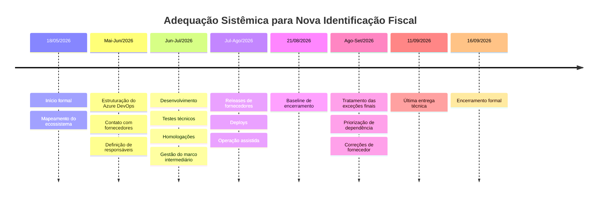

# Adequação Sistêmica para Nova Identificação Fiscal

### Case de Gerenciamento de Projetos | Digital Transformation | Regulatory Change | Enterprise Systems

**Gerente de Projetos:** João Henrique Gusmão Esteves  
**Período formal do projeto:** 18/05/2026 a 16/09/2026  
**Última entrega técnica:** 11/09/2026  
**Abordagem:** execução adaptativa em sprints, combinada com governança formal de projeto

> **Confidencialidade:** este case foi reconstruído e anonimizado exclusivamente para fins de portfólio profissional. Nomes da organização, colaboradores, fornecedores específicos, identificadores internos, registros de chamados, documentos corporativos, dados comerciais e detalhes sensíveis da arquitetura foram removidos ou generalizados.

---

## Visão Geral do Projeto

| Indicador | Resultado |
| :--- | :---: |
| Sistemas no escopo | **35** |
| Macrofrentes estruturadas | **7 épicos** |
| Controle por sistema | **35 Features** |
| Features concluídas no encerramento | **35 de 35** |
| Cadência de execução | **Sprints de 2 semanas** |
| Baseline de término | **21/08/2026** |
| Última entrega técnica | **11/09/2026** |
| Encerramento formal | **16/09/2026** |
| Situação final | **Escopo técnico concluído** |
| Pendências residuais | **Transferidas formalmente para sustentação** |

*As métricas foram consolidadas a partir da documentação de encerramento e dos registros de governança do projeto. Dados identificáveis da organização foram removidos.*

---

## Contexto

Uma mudança regulatória determinou que um importante **identificador fiscal corporativo de 14 posições**, tradicionalmente tratado como exclusivamente numérico, passaria a admitir também **caracteres alfabéticos**.

A alteração parecia simples do ponto de vista conceitual. Do ponto de vista sistêmico, não era.

O identificador era utilizado como chave de negócio em diferentes componentes do ecossistema tecnológico:

- ERPs;
- plataformas de HCM;
- CRM;
- ITSM;
- portais;
- aplicações de canais digitais;
- integrações e APIs;
- sistemas satélites;
- Data Lake e Data Warehouse;
- plataformas analíticas e relatórios.

Campos, máscaras, algoritmos de validação, consultas, integrações e regras desenvolvidas durante anos assumiam que o identificador seria sempre numérico.

Uma mudança regulatória localizada transformou-se, portanto, em uma **adequação sistêmica corporativa transversal**.

---

## O Desafio

O projeto precisava responder a uma pergunta aparentemente simples:

> **Quais sistemas deixariam de funcionar corretamente quando o primeiro identificador fiscal alfanumérico surgisse?**

Responder exigiu mapear aplicações, integrações, fornecedores e processos distribuídos por várias áreas.

O desafio não estava somente no desenvolvimento. Era necessário coordenar sistemas internos e soluções de mercado, diferentes fornecedores, calendários próprios de release, times técnicos distintos, Key Users, integrações, testes, homologações e dependências externas — tudo sob uma data regulatória que não dependia do cronograma interno do projeto.

Isso transformou o trabalho em um exercício de **gestão de portfólio sistêmico dentro de um único projeto**.

---

## Meu Papel como GP

Atuei como **Gerente de Projetos**, sendo o ponto central de coordenação entre negócio, tecnologia, arquitetura, dados, fornecedores e usuários responsáveis pelas homologações.

Minha atuação incluiu:

- estruturação da governança do projeto;
- planejamento e acompanhamento do cronograma;
- organização do modelo de execução no Azure DevOps;
- coordenação do levantamento dos sistemas impactados;
- definição da estrutura de épicos, Features, User Stories e Tasks;
- acompanhamento dos fornecedores responsáveis pelas soluções de mercado;
- gestão de riscos, dependências e impedimentos;
- acompanhamento das sprints;
- coordenação de Key Users;
- acompanhamento dos testes e homologações;
- consolidação e comunicação dos Status Reports;
- escalonamento de impedimentos;
- gestão de mudanças de critério e marcos;
- acompanhamento das exceções;
- coordenação da entrada em produção;
- operação assistida;
- transição das pendências residuais para sustentação;
- encerramento formal do projeto.

---

## Estruturação no Azure DevOps

Um dos pilares de governança foi transformar o universo de aplicações em uma estrutura rastreável de trabalho.

| Nível | Função |
| :--- | :--- |
| **Épico** | Macrofrente sistêmica |
| **Feature** | Um sistema do escopo |
| **User Story** | Entrega, adequação ou cenário relevante |
| **Task** | Atividade técnica ou operacional |
| **Bug** | Correção identificada durante validação |

### 7 épicos · 35 sistemas · 35 Features concluídas

Esse modelo permitiu acompanhar cada aplicação individualmente sem perder a visão executiva do projeto.

---

## Modelo de Execução

A execução foi organizada em ciclos quinzenais.

O modelo permitia que sistemas avançassem em velocidades diferentes. Enquanto algumas aplicações já estavam concluídas, outras ainda dependiam de fornecedor, desenvolvimento, homologação ou janela de implantação.

Essa característica tornou inadequado administrar o projeto como uma única entrega monolítica.

---

## Governança dos Key Users

A mudança atingia processos de negócio diferentes. Por isso, a homologação não poderia ficar exclusivamente com Tecnologia.

Foi estruturada uma rede de **Key Users**, responsáveis por validar os cenários relacionados às suas áreas e sistemas.

Cada entrega precisava manter rastreabilidade mínima sobre responsável, cenário, status, evidência, aprovação e observações relevantes.

O Azure DevOps funcionou como **fonte central de acompanhamento do projeto**.

---

## Gestão de Fornecedores

Parte relevante dos 35 sistemas não era desenvolvida internamente.

Isso significava que o projeto dependia de diferentes fornecedores disponibilizando versões compatíveis, patches, correções, orientações técnicas, datas de release e apoio para testes.

O principal risco era claro: **o cronograma interno poderia estar pronto enquanto a organização ainda dependia do calendário de release de terceiros**.

A resposta de gestão foi acompanhar os sistemas individualmente, registrar datas previstas, separar exceções e escalar antecipadamente dependências que colocassem marcos em risco.

---

## Um Ponto Crítico: o Critério de Aceite

Durante a execução surgiu um dos principais desafios de governança do projeto.

O critério inicialmente utilizado para considerar um sistema concluído pressupunha:

**desenvolvido + testado + implantado em produção.**

Entretanto, alguns fornecedores possuíam datas de release posteriores ao marco executivo utilizado pela organização.

Isso tornou necessária uma discussão explícita sobre o significado de **entrega naquele marco intermediário**.

### Critério original

### 24 de 35 sistemas · **68,6%**

### Critério executivo revisado

O critério passou a reconhecer como atendidos naquele marco sistemas já tecnicamente desenvolvidos, ainda que permanecessem em homologação ou aguardando deploy.

### 33 de 35 sistemas · **94,3%**

Os dois sistemas ainda não atendidos permaneceram explicitamente identificados e acompanhados.

### Aprendizado gerencial

**Definition of Done não pode ser alterada silenciosamente para melhorar um indicador.**

Quando o critério muda, a decisão precisa ser explícita, rastreável, comunicada, acompanhada das exceções e diferenciada do encerramento definitivo.

No encerramento final, o cenário já era outro:

### **35 de 35 Features concluídas.**

---

## Gestão de Riscos

| Risco / dependência | Tratamento |
| :--- | :--- |
| Releases de fornecedores fora do prazo necessário | Acompanhamento individual, escalonamento e gestão por exceção |
| Sistemas não identificados no levantamento inicial | Mapeamento transversal por área e revisão contínua do inventário |
| Integrações que assumiam identificador exclusivamente numérico | Análise técnica e testes por cenário |
| Alteração regulatória adicional | Acompanhamento da regulamentação e adaptação do plano |
| Baixa disponibilidade de Key Users | Definição de responsáveis e acompanhamento das homologações |
| Bugs identificados durante testes | Correção, reteste e manutenção da rastreabilidade |
| Dependência de outro produto ou squad | Priorização formal dentro da respectiva esteira |
| Impossibilidade de testar cenário externo real | Transferência formal da validação residual para sustentação |

---

## Dependências que Estenderam o Cronograma

A baseline de término do projeto era **21/08/2026**. A última entrega técnica ocorreu em **11/09/2026**.

A extensão final ficou concentrada principalmente em duas situações.

### Dependência de outra esteira de produto

Uma das aplicações precisava ser modificada por uma squad que mantinha seu próprio backlog e planejamento.

A adequação precisou ser formalmente priorizada dentro da release daquele produto antes de ser desenvolvida, testada e concluída.

### Solução de terceiro com ciclos sucessivos de correção

Outro sistema apresentou incompatibilidade durante a validação. A estabilização exigiu:

### **3 ciclos de atualização e correção com o fornecedor**

antes que o comportamento esperado fosse confirmado.

---

## Linha do Tempo

---

## Principais Decisões Gerenciais

### 1. Tratar cada sistema como unidade rastreável
Cada aplicação recebeu sua própria Feature, evitando que o status global escondesse sistemas ainda pendentes.

### 2. Gerenciar o projeto por exceção
Com dezenas de aplicações avançando paralelamente, a governança concentrou atenção nos sistemas bloqueados, atrasados ou dependentes de terceiros.

### 3. Separar marco executivo de conclusão definitiva
A redefinição de um critério intermediário não foi confundida com o encerramento final do projeto.

### 4. Formalizar a dependência de outras squads
Quando uma adequação dependia de outro produto, a demanda foi inserida e priorizada na própria esteira responsável.

### 5. Aceitar que fornecedores podem exigir mais de um ciclo de correção
O planejamento deixou de pressupor que uma única atualização de versão resolveria necessariamente uma incompatibilidade.

### 6. Transferir adequadamente validações impossíveis no período do projeto
Cenários dependentes da existência de identificadores oficiais ainda indisponíveis foram formalmente transferidos para operação e sustentação, sem manter artificialmente o projeto aberto.

---

## Resultados

Ao encerramento foram registrados:

- **35 sistemas tratados**;
- **7 épicos concluídos**;
- **35 Features concluídas**;
- adequações distribuídas entre ERP, HCM, CRM, ITSM, portais e plataformas de dados;
- estrutura central de governança no Azure DevOps;
- acompanhamento individual por sistema;
- processo estruturado de testes e homologação;
- participação de Key Users;
- coordenação de múltiplos fornecedores;
- gestão formal das exceções;
- rastreabilidade de decisões e mudanças de critério;
- conclusão das dependências técnicas finais;
- transferência das validações residuais para sustentação;
- encerramento formal do projeto.

> O principal resultado não foi apenas alterar sistemas para aceitar um novo formato de identificação. Foi criar uma estrutura capaz de **coordenar uma mudança regulatória transversal em dezenas de aplicações sem perder visibilidade, ownership ou rastreabilidade**.

---

## GitHub Project — Reconstrução Executiva

Além do README, este case possui **16 Issues representativas** que funcionam como cards de uma reconstrução executiva e anonimizada da gestão do projeto.

Os itens cobrem governança, sistemas, integrações, riscos, dependências e fornecedor, preservando a lógica de acompanhamento sem expor dados corporativos reais.

  
  

**Estrutura preparada:**
- 16 cards históricos concluídos;
- metadados de macrofrente, sprint, risco, dependência e homologação;
- blueprint de campos e views para GitHub Projects;
- inventário em CSV;
- template para novos cards.

> O GitHub Project deve funcionar como um **digital twin executivo e anonimizado** da governança do projeto.

---

## Lições Aprendidas

1. **Mudanças regulatórias precisam ser tratadas como portfólio de impactos.** Uma única alteração normativa pode atravessar dezenas de aplicações, integrações e processos.
2. **Inventário de sistemas é parte crítica da gestão.** Não é possível adequar aquilo que a organização não sabe que utiliza determinada informação.
3. **Dependências de fornecedores precisam ser descobertas cedo.** Calendários externos de release podem definir o caminho crítico.
4. **O plano deve prever ciclos de correção.** Atualizações de terceiros podem introduzir bugs ou não resolver integralmente o problema na primeira versão.
5. **Key Users precisam ter ownership claro.** Homologação distribuída sem responsáveis definidos cria gargalos próximos ao Go-Live.
6. **Critério de aceite precisa ser inequívoco.** Mudanças na Definition of Done devem ser registradas e comunicadas.
7. **Projeto e sustentação precisam ter uma fronteira objetiva.** Validações futuras que não bloqueiam o aceite técnico devem possuir responsável e processo de continuidade.

---

## Tecnologias, Métodos e Disciplinas

  
  
  
  
  
  
  
  

---

## Sobre este Case

Este repositório apresenta uma **reconstrução profissional e anonimizada** de um projeto corporativo de adequação regulatória concluído em 2026.

Nenhum documento corporativo original é publicado.

A documentação interna foi utilizada exclusivamente como fonte factual para reconstruir:

**contexto → governança → planejamento → execução → riscos → decisões → resultados → lições aprendidas.**

**João Henrique Gusmão Esteves**  
Gerenciamento de Projetos de Tecnologia | PMO | Transformação Digital

 

<table width="100%">
  <tr>
    <td colspan="2" align="center">
      <strong>Geek Note</strong>
    </td>
  </tr>
  <tr>
    <td width="140" valign="middle" align="center">
      
    </td>
    <td valign="middle" align="center">
      <strong>Espaço: a fronteira final. 
      Nossa missão: fazer 35 sistemas 
      entenderem uma nova linguagem fiscal. 🖖</strong>
    </td>
  </tr>
</table>
